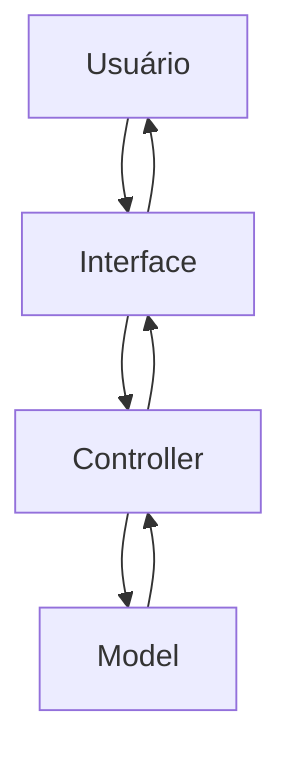
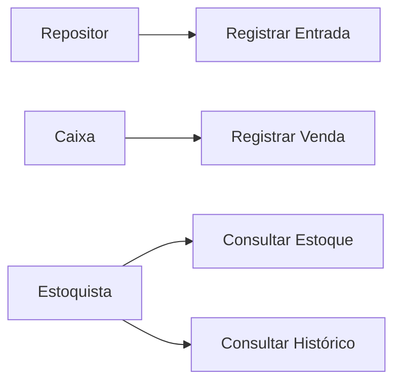
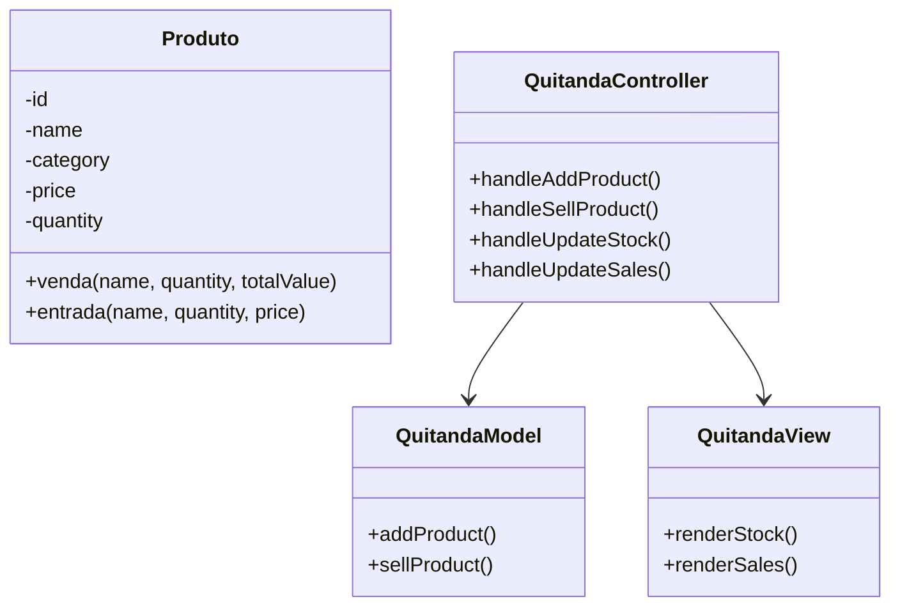
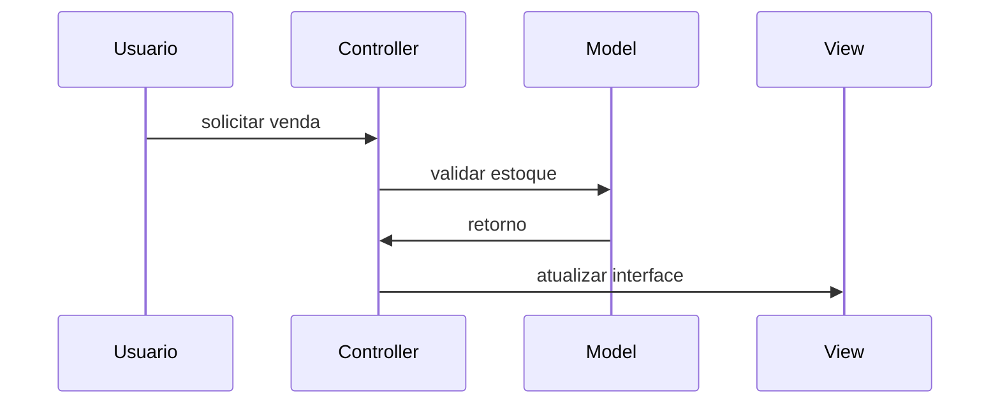
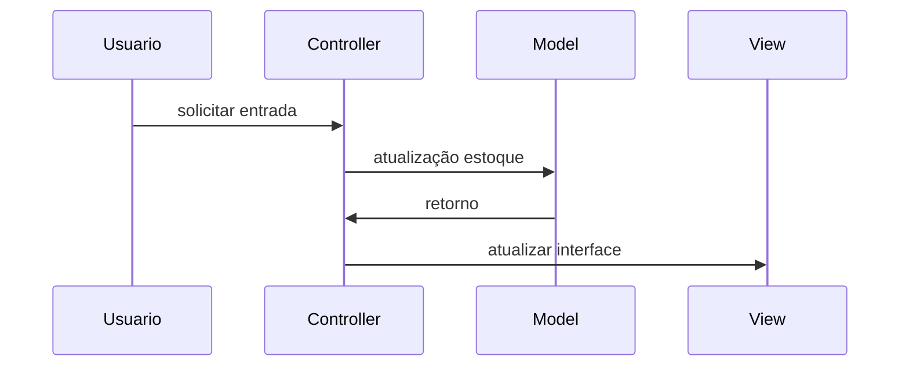
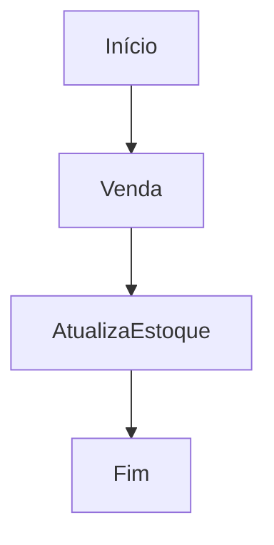
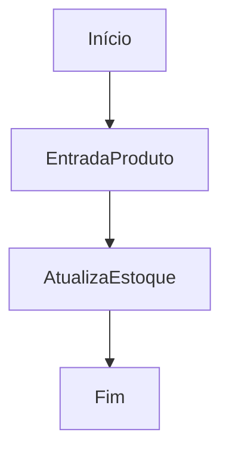

# Documentação de Especificações de Requisito de Software (SRS)
Documento baseado na ISO/IEEE 29148:2018

## Sistema de Controle de Quitanda (Quitanda MVC)

**Padrão:** ISO/IEC/IEEE 29148:2018
**Versão:** 1.0.0
**Data:** 2026-04-14
**Autor:** Pedro Lanaro

---

## 1. Introdução

### 1.1 Propósito

Este documento  descreve os requisitos do sistema **Quitanda MVC**, com objetivo de :

* definir funcionalidades
* padronizar entendimento entre stakeholders
* servir como base para desenvolvimento e testes

---

### 1.2 Escopo

O sistema permitirá:

* registro de entrada de produto
* registro de vendas
* controle de estoque
* histórico de movimentações

O Sistema será uma aplicação web frontend utilizando:

* HTML
* CSS
* JavaScript
* Arquitetura MVC
* Estrutura POO

---

### 1.3 Definições

| Termo   | Definições |
| ------- | ---------- |
| Produto | Item Comercializado na quitanda |
| Entrada | Registro de chegada de produto |
| Venda   | Registro de saída de produto |
| Estoque | Quantidade disponivel de produtos |

Acrônimos

* **SGQ** -  Sistema de gestão de Quitanda
* **RF** - Rquisito Funcional
* **RNF** - Requisito Não-Funcional

---

### 1.4 Visão Geral do Documento

Este documento esta organizado em 

* introdução e visão geral
* descrição do sistema
* requisitos detalhados 
* modelos UML
* regras de negócio

---

## 2. Descrição Geral do Sistema

### 2.1 Perspectiva so Sistema

O sistema é standalone (frontend), operado em navegador

---

### 2.2 Funções dos Sistema

 O Sistema deve:

 * cadastrar produtos
 * atualizar estoque
 * resgistrar vendas
 * validar operações
 * exibir dados
 
 ---

 ### 2.3 Classes de usuários

 | Usuários     | Descrição   |
 | ----------   | ----------- |
 | Estoquista   | Gerencia estoque |
 | Caixa        | Realiza Vendas |
 | Repositor    | Registra entradas |

 ---

 ### 2.4 Ambiente Operacional

 * Navegador Web ( Chrome, Edge, Firefox)

 ---

 ### 2.5 Restrições

 * Não utiliza Banco de Dados
 * Dados Armazenados na Memória
 * Sem Autenticação de Usuário

### 2.6 Suposições

* Usuário possui conhecimetnos básico de informática
* Volume de dados em pequeno

---

## 3. Requistos do Sistema

### 3.1 Requisitos Funcionais

#### RF-001: Cadastro de produto

**Descrição:** Permitir cadastrar um produto

- **Prioridade:** Alta
- **Versão:** 1.0
- **Data:** 2026-04-14
- **Rastreabilidade:** Necessidade do Stakeholder 001

**Critérios de Aceitação:**
- [ ] Entrada de Dados: Nome, Categoria, Preço, Quantidade
- [ ] Validação de Campos 
- [ ] Verificação de Duplicidade
- [ ] Saída: Notificação ao Usuário

---

#### RF-002: Atualizar Estoque

**Descrição:** Permitir atualização de dados de items existentes

- **Prioridade:** Alta
- **Versão:** 1.0
- **Data:** 2026-04-14
- **Rastreabilidade:** Necessidade do Stakeholder 002

**Critérios de Aceitação:**
- [ ] Verificar se item já está cadastrado
- [ ] Entrada de Dados: Nome, Categoria, Preço, Quantidade
- [ ] Validação de Campos 
- [ ] Saída: Notificação ao Usuário

---

#### RF-003: Listagem de Estoque

**Descrição:** Exibir Informações dos produtos Cadastrados

- **Prioridade:** Alta
- **Versão:** 1.0
- **Data:** 2026-04-14
- **Rastreabilidade:** Necessidade do Stakeholder 003

**Critérios de Aceitação:**

- [ ] Listagem dos produtos
- [ ] Saída: Id, Nome, Categoria, Preço, Quantidade

---

#### RF-004: Registro de Vendas

**Descrição:** Permitir vender produtos

**Prioridade:** Alta
**Versão:** 1.0
**Data:** 2026-04-14
**Rastreabilidade:** Necessidade do Stakeholder 004 

**Critérios de Aceitação:**
- [ ] Venda de Produtos Cadastro
- [ ] Verificação de Quantidade
- [ ] Atualização do Estoque
- [ ] Notificação de Venda Realizada

---

#### RF-005: Histórico de Movimetações

**Descrição:** Permitir o Registro de Movimentações ( Entrada e Saída) de Produtos

**Prioridade:** Média
**Versão:** 1.0
**Data:** 2026-04-14
**Rastreabilidade:** Necessidade do Stakeholder 005

**Critérios de Aceitação:**
- [ ] Registro das Movimentações em uma Lista
- [ ] Consulta das Movimentações
- [ ] Verificação de Duplicidade
- [ ] Saída: Notificação ao Usuário

---

### 3.2 Requistos Não Funcionais

#### RNF-001: Usabilidade

**Descrição:** Interface Simples e Intuitiva

---

#### RNF-002: Desempenho

**Descrição:** Respostas rápidas e inferiores a 1 segundo

---

#### RNF-003: Arquitetura MVC

**Descrição:** Estruturação da Arquitetura do Código em MVC

---

#### RNF-004: Confiabilidade

**Descrição:** Validação de Entrada de Dados orbigatória

---

## 4. Regras do Negócio

Tabela de Regras de Negócio

| Regras de Negócio | Descrição |
| ----------------- | --------- |
| RN-001            | Quantidade de produtos não pode ser negativa |
| RN-002            | Preço do Produto não pode ser Negativo |
| RN-003            | Nome do Produto é Obrigatório |
| RN-004            | Venda só pode ser realizada se estoque for suficiente |
| RN-005            | Toda Movimentação deve ser Registrada |

--- 

Podem Existir Restrições para o Negócio (legais, movimentação, local)

## 5. Modelos do Sistema

### 5.1 Diagrama de Casos de Uso

Diagrama de Casos de Uso: O que o sistema deve fazer do ponto de vista do usuário

### 5.2 Diagrama de Classes UML

Diagrama de Classes UML: Estrutura do código, classes, atributos e métodos

---

### 5.3 Diagrama de Sequência

Diagrama de Sequência: Interação entre objetos ao longo do tempo para realização de uma funcionalidade específica

#### 5.3.1 Venda

#### 5.3.2 Atualização de Estoque

### 5.4 Diagrama de Atividades

Diagrama de Atividades: Fluxo de atividades para realização de uma funcionalidade específica

#### 5.4.1  Venda

#### 5.4.1  Entrada

---

## 6. Análise de Risco

### 6.1 Matriz de Análise de Risco

| Risco      | Impacto   | Mitigação |
| - | - | - |
| Perda de Dados | Alto | usar localStorage |
| Entrada de Dados | Médio | validar as Entradas de dados |

---

## 7. Controle de Versões

### 7.1 Histórico de Alterações

| Versão | Data | Autor | Modificação |
| - | - | - | - |
| 1.0.0 | 2026-04-28 | DiogoTB | Versão Inicial |

### 7.2 Aprovações
| Papel | Nome | Data | Assinatura |
| - | - | - | - |
| Stakeholder | Seu Joaquim | 2026-04-29 | [] |